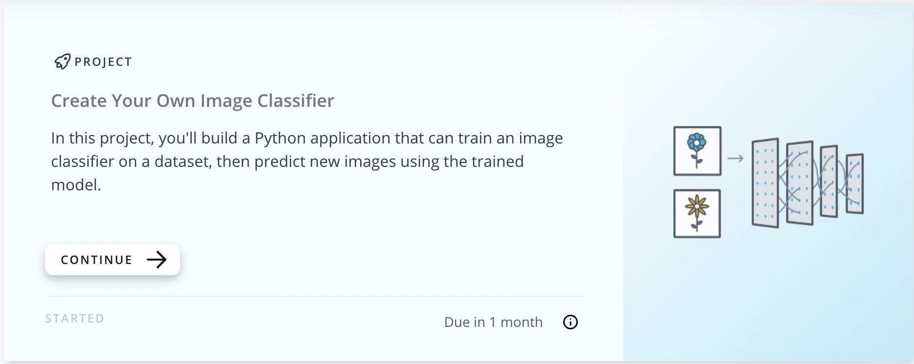

# Create your own image classifier

> Final capstone that I worked on as part of the [AI programming in Python](https://www.udacity.com/course/ai-programming-python-nanodegree--nd089) nanodegree at Udacity. The aim of the project was to build a Python application that can train an image classifier on the [102 Category Flower Dataset](https://www.robots.ox.ac.uk/~vgg/data/flowers/102/index.html), and then predict new flower images using the trained model.



The project implements an image classification application. The application trains a deep learning model on a data set of images, then uses tha trained model to classify images. The code is first implemented in a Jupyter notebook to make sure the training implementation works, and then it is converted into a Python application that runs from the command line.

## Languages and tools

## Goals of the project

## Walk through: The classifier

### Preparation of the Tensor data & label mapping

To make sure my neural network trained properly, I started the project by organising the training images in folders named as their class name. These were organised within training, testing and validation folders, as follows:

```python
data_dir = 'flowers'
train_dir = data_dir + '/train'
valid_dir = data_dir + '/valid'
test_dir = data_dir + '/test'
```

It must be noted that the image folders names are not the actual names of the flowers in them, but rather numbers. Accordingly, Udacity provided a .json file, `cat_to_name.json`, which contained the mapping between flower names and folder labels. Basically, what will happen later on in the project is that my model will predict and return an index between 0 and 101, which corresponds to one of the folder labels (1-102). In turn, the folder labels (1-102) correspond to flower names that the .json file maps.

I then adapted my images to work with the pre-trained networks of the torchvision library, which were trained on the ImageNet dataset. First, I defined transformations on the image data which included resizing these to 224x224 pixels. Subsequently, I created Torch Dataset objects using ImageFolder. This is done as follows:

```python
# loads the datasets using ImageFolder
train_data = datasets.ImageFolder(data_dir + '/train', transform=train_transforms)
test_data = datasets.ImageFolder(data_dir + '/test', transform=test_transforms)
valid_data = datasets.ImageFolder(data_dir + '/valid', transform=test_transforms)
```

Finally, I created Data Loader objects to make sure I could work on my data. 

### Upload of the pre-trained model and preparation of the classifier

The fully-connected layer that I then trained on the flower images was as follows:

```python
classifier = nn.Sequential(OrderedDict([
                          ('fc1', nn.Linear(25088, hidden_units)),
                          ('relu', nn.ReLU()),
                          ('dropout1', nn.Dropout(0.05)),
                          ('fc2', nn.Linear(hidden_units, no_output_categories)),
                          ('output', nn.LogSoftmax(dim=1))
                          ]))
```

I chose to work with a highly accurate Convolutional Network, VGG16, which is abysmally slow to train (in my case, about 30 minutes per epoch). Note that I had previously defined the `hidden_units` as being 4096, while `no_output_categories` corresponds to the length of `cat_to_name.json`, i.e. 102.

### Training of the network

Below is a heapload of code. Feel free to read through it if you want, but if you want the TL;DR version of this code, here it is...

Sets hyperparameters for training (i.e. epochs, learning rate, etc).
Uses active_session() (function provided by Udacity) to make sure the vm I used with GPU doesn't sleep on me while I'm training.
Loops through epochs
1 batch is 64 images. The model trains on 20 batches at at time (as defined by print_every)
After the 20 batches, we test our model's progress on the validation data
Then we print our training and validation metrics (skip ahead below to see the metrics).

## Walk through: The command line application
